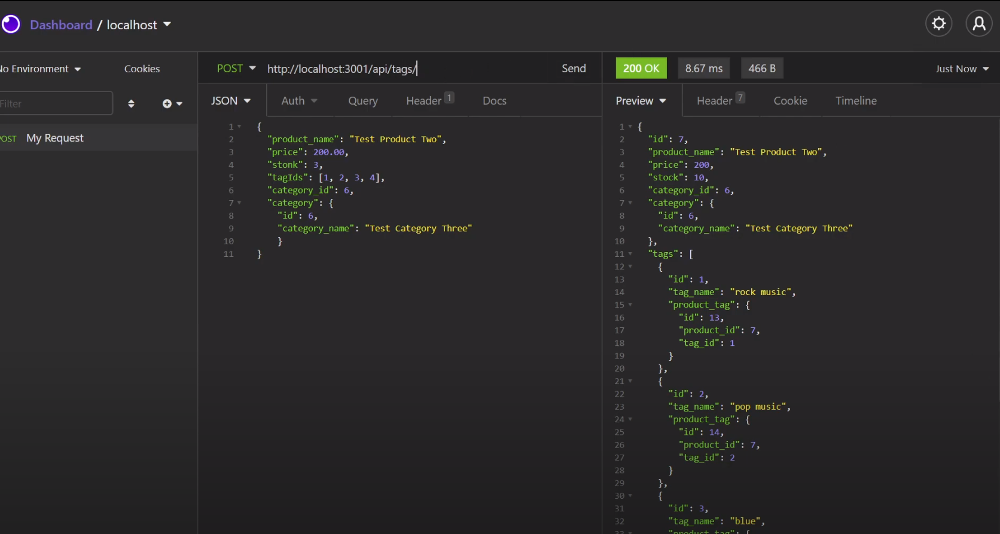

## Video Walkthrough
https://www.youtube.com/watch?v=mgMSLgpr0Gk

# E-Commerce

# Contact
Vygoth
JeremyJoanet@Protonmail.com

## Description
This app allows you to log in to the app, connect to a database, enter database information (schema, seeds), pull that database information, create / read / update / delete dynamically through an an application like Insomnia. This application was developed to help with my understanding of back-end data manipulation.

## Table of Contents
- [Usage](#Usage)
- [Installation](#Dependancies)
- [Testing](#Testing)
- [Credits](#Credits)
- [Contributing](#Contributing)
- [Screenshot](#Screenshot)

## Usage
N/A

## Dependancies
NPM Install

## Testing
Tests should be run through insomnia after placing this applications path and following the specified routes.

## Credits
Matt Reisdorf, Zach Duty, Michael Francisco.

## Contributing
N/A

## Screenshot

